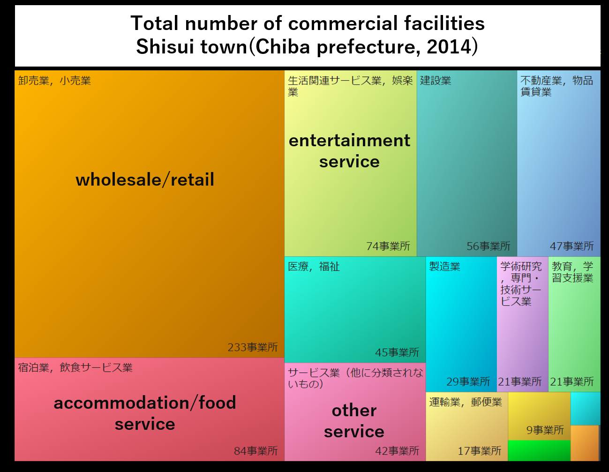

```{r}
# 使用package
suppressMessages(library(readxl))
suppressMessages(library(dplyr))
suppressMessages(library(data.table))
suppressMessages(library(kableExtra))
suppressMessages(library(curl))
suppressMessages(library(tidyverse))
```


# dsjkkfjldsjfsd

[aaa][1]

[阪大][2]


[1]:https://www.google.com/?client=safari "google"





# jdkslfjdslf

- [x] djksfjlkdsfjldks
- [ ] djksfjlkdsfjldks

|aa|bb|
|----|----|
|11|22|
|11|22|
|11|22|
|11|22|
|11|22|

```{r, child="bb.rmd"}

```

:::{style="display:flex"}

::{}
# sdjfldsj
```{r}
suppressMessages(library(tidyverse))
iris %>% tbl_df() %>% head()
```
::

::{}
# skdjlfjdslf
```{r}
cars %>% DT::datatable()
```
::
:::


[2]:https://web.auth.osaka-u.ac.jp/portal/ja/

